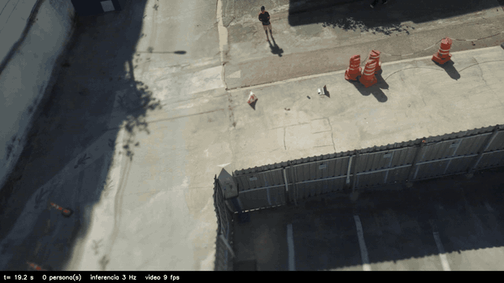

# uav-vision

**Find people on the ground from a drone's camera and report where they are.
One camera. No laser rangefinder, no stereo rig. 2.4 m median error, 3 FPS on a
Raspberry Pi 5.**

<!-- Upload demo.gif to a GitHub issue and paste the resulting URL here, so the
     binary never enters the repository. -->


A drone sees a person from several positions along its path. Each detection
becomes a ray; the rays are intersected with the ground; the intersections are
fused into one coordinate. That is the whole idea, and it needs neither a second
camera nor a rangefinder.

## Run it on a real flight, without a drone

```bash
git clone https://github.com/sebastianquispearias/uav-vision
cd uav-vision && pip install -e .
python demo/demo.py
```

It replays a recorded flight (2026-08-02) through the same protocol that runs on
the aircraft — the poses are the ones the Pixhawk logged, the detections are the
ones the detector produced in the air — opens the ground station in a browser,
and fills the map as the reports arrive. Then it prints:

```
CHEQUEO DE RAYOS (268 muestras, 1 de cada 10 frames)
  angulo protocolo vs vuelo real: mediana 0.000 deg, p90 0.000 deg
  >> rayos del protocolo coinciden con los del vuelo real

REPLAY CON IDENTIDAD (102 reportes)
  #      tipo  n_obs  conf              pos  d_PIES
  0  estatico    209  0.53 ( -0.16,  6.70)    2.39   <- OPERADOR

  mejor POI respecto al operador: 2.39 m
```

2.39 m from a surveyed ground truth. `--sin-mapa` skips the browser.

## What it costs on the aircraft

Measured on a Raspberry Pi 5 with the real camera, detector plus OSNet
re-identification:

| input size | detector | + OSNet | FPS | CPU |
|---|---|---|---|---|
| 640  |  70.6 ms | 111 ms | 9.0 | 65 % |
| 960  | 160.7 ms | 201 ms | 5.0 | 80 % |
| 1280 | 311.7 ms | 352 ms | 2.8 | 90 % |

Moving from torch to NCNN bought 3.3x (12.47 against 3.74 FPS). Peak draw of the
whole board is 11.71 W.

And an ablation worth reading before optimising the detector: on the same 2983
frames, raising mAP50 from 0.305 to 0.464 moved the geolocation error from
2.49 m to 2.45 m. The floor is GPS and yaw bias, not perception.

---

Detection and camera geometry for vision-based target geolocation from UAVs.

The same interface runs in **simulation** (GrADyS-SIM) and on the **real drone**
(Raspberry Pi + camera). The package imports nothing from GrADyS, the simulator
or MAVLink, except for the single protocol module noted below — it can be
installed on its own.

## The camera contract

The whole module reduces to one method, exposed identically by both cameras:

```python
camera.detect(pos, yaw) -> list[dict]
```

| Input | Type | Meaning |
|---|---|---|
| `pos` | `(x, y, z)` float, meters | camera position, local ENU frame (x=East, y=North, z=Up) |
| `yaw` | float, degrees | heading. 0 = North, 90 = East, clockwise |

The output is a list of detections; an empty list means nothing was detected.

```python
[{'px': 960.0, 'py': 805.0, 'conf': 0.846}, ...]
```

| Field | Required | Meaning |
|---|---|---|
| `px` | yes | horizontal center of the detection, pixels |
| `py` | yes | **bottom edge** — the point where the object touches the ground |
| `conf` | yes | detector confidence in (0, 1] |
| `emb` | no | appearance embedding: 512 normalized `float32` (OSNet) |
| `track_id` | no | stable identity assigned by the tracker |

`py` is the bottom edge because a standing person touches the ground with
their feet; using the box center would aim the ray at the waist and place the
ground intersection too far. `conf` feeds the view selector and is not
informational. Optional fields appear only when the camera can compute them —
read them with `det.get(...)`, never `det[...]`.

## Usage

```python
from uav_vision.camera import SimulatedCamera, OnboardCamera

# simulation
camera = SimulatedCamera(target=(0.0, 0.0, 0.0), pitch_deg=-55.0)

# real drone, full pipeline: detector + embeddings + tracker
camera = OnboardCamera(model="best_ncnn_model", tracker=True, fps=4.0,
                       reid_model="osnet_x0_25_msmt17.pt")

# from here on the consumer code is identical
for det in camera.detect(pos, yaw):
    ...
```

The constructors differ on purpose — the simulated camera needs to know where
the target is, the real one needs a detector model. Only `detect` must
match. `OnboardCamera` imports `picamera2`, `ultralytics` and `boxmot` on the
first capture, so the package imports cleanly on machines without them.

`correr.py` runs the full geolocation pipeline of the paper in either world:

```bash
python correr.py sim     # geometric camera, no images
python correr.py dron    # real captures + YOLO
```

## The GrADyS protocol

`vision_protocol.py` — the only module that imports `gradys_embedded` — wraps
the camera as an observe-only GrADyS protocol: it never sends mobility
commands, so it composes with any mission. On a timer it captures, detects,
back-projects each detection to a ground impact and feeds the identity layer;
every report period it broadcasts the consolidated POI list as JSON.

- **Position** arrives through `handle_telemetry` (the shared local frame).
- **Yaw** is not part of GrADyS telemetry; on the drone it comes from
  `UavApiYaw`, which polls the `uav_api` HTTP service on localhost (that
  service owns the MAVLink serial link). In simulation a function is injected.
- **Configuration** goes through
  `VisionProtocol.with_config(camera=..., pitch_deg=..., yaw_source=...)`,
  because GrADyS instantiates protocols with no constructor arguments.

`identity.py` turns tracked detections into named POIs: image-plane tracks are
summarized on the ground, classified static vs mobile, and merged by position
and appearance under a co-occurrence veto. Thresholds are parameters whose
defaults come from measurements — see `NOTES.md` for the provenance of every
number.

`manifest.yaml` describes the module as a discoverable skill (capabilities,
requirements, activation, message schema) for the ground-station LLM agent.

## Installation

```bash
pip install -e .              # laptop / simulation
pip install -e ".[dron]"      # + ultralytics, boxmot (picamera2 ships with Raspberry Pi OS)
```

## Tests

```bash
python tests/test_contract.py          # both cameras honor the same contract
python tests/test_identity.py         # identity rules against known ground truth
python tests/test_vision_protocol.py   # end-to-end synthetic flight (needs ../gradys-embedded)
python tests/test_tracker.py        # tracker wiring (needs boxmot)
python scripts/replay_vuelo3.py        # replay of a recorded real flight through the protocol
```

## Contents

| File | Purpose |
|---|---|
| `camera.py` | the two cameras; the contract |
| `pinhole_local.py` | pixel ↔ ray projection, pure math |
| `camera_config.py` | camera intrinsics |
| `confidence.py` | confidence-to-noise models |
| `identity.py` | tracked detections → named POIs (static/mobile) |
| `vision_protocol.py` | the GrADyS protocol; only module importing `gradys_embedded` |
| `fusion.py` | robust multi-view triangulation (RANSAC and variants) |
| `view_selection.py` | joint geometry+confidence view selector |
| `noise.py` | sensor noise models for simulation |
| `invariants.py` | guards for derived quantities: rates, declared-vs-delivered, stamped caches |
| `manifest.yaml` | skill manifest for the LLM agent |
| `NOTES.md` | decision log: where every calibrated number comes from |

## Naming

The package API is English throughout — module names, classes, methods and keyword
arguments — so that a reader who does not speak Spanish can use it from the README
alone. The operational scripts under `scripts/` keep Spanish command-line flags and
messages: they are field tools, run from memory by the team that flies the drone,
and their commands appear in the flight checklists.

## Why this package exists

The pixel-to-ray math used to live in four places (the onboard script, the
offline pipeline, an earlier field script and the simulator showcase) with
different signatures and different constants. One copy with a stale mount
angle produced a position error larger than the total error the method
reports. With a single module imported by everyone, that divergence cannot
happen.

## Known limitations

- POI coordinates are in the local mission frame, not lat/lng; conversion
  requires the mission origin from the ground station.
- Flat-terrain assumption (ground plane at a fixed z).
- The full onboard chain (camera + tracker + identity on the Pi) has been
  validated piecewise and in replay, not yet end-to-end in flight.
- Focal length and principal point come from flight logs; checkerboard
  calibration is pending.
