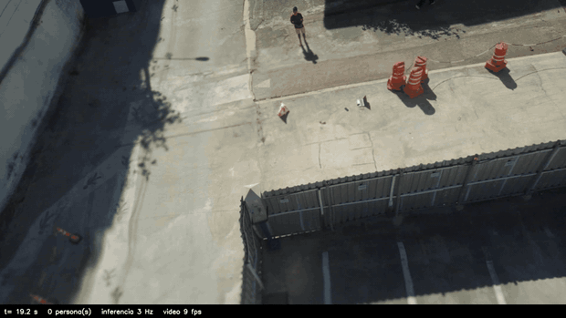
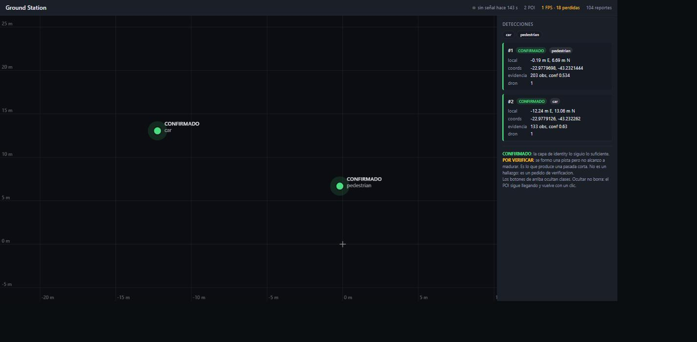
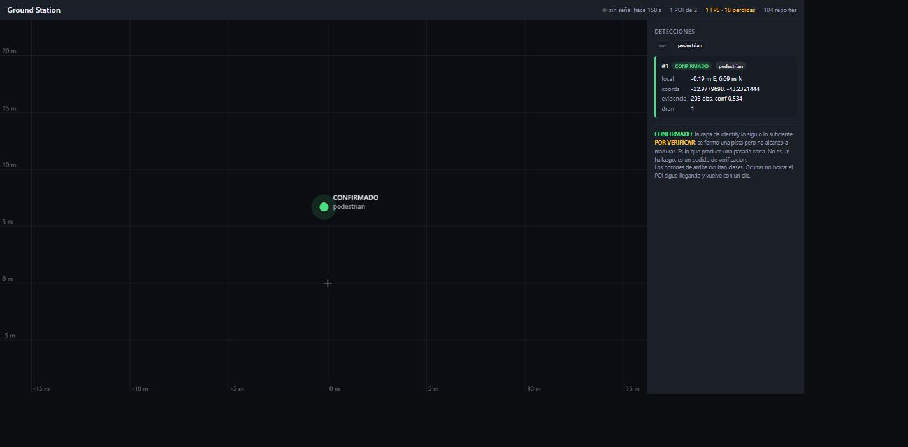

# uav-vision

**Find people on the ground from a drone's camera and report where they are.
One camera. No laser rangefinder, no stereo rig. 2.4 m median error, 3 FPS on a
Raspberry Pi 5.**

<!-- Upload demo.gif to a GitHub issue and paste the resulting URL here, so the
     binary never enters the repository. -->


A drone sees a person from several positions along its path. Each detection
becomes a ray; the rays are intersected with the ground; the intersections are
fused into one coordinate. That is the whole idea, and it needs neither a second
camera nor a rangefinder.

## What it does not do

Every number above is a median over the one flight that has surveyed ground truth. Here is the
same flight scored the way a mission would score it, in people reached and false points walked to:

```
  people really reported:  5 of 7   ->  A(1) B(1) C(1) G(3) H(1)
  never reported:          D, E
  phantoms (candidates that are nobody):  6
```

Five people found, and six points an operator would have to walk to for nothing. Two people the
system never reports at all. That is the honest headline, and the rest of this list is why.

- **The detector misses 44 % of the appearances** a human confirmed (660 missed against 835
  found), and 598 of those 660 are a single scene: people on a balcony, raised, behind a railing,
  against a building instead of against grass.
- **Flying closer does not fix it.** Measured within the same frame, where the aircraft's altitude
  and the light are identical, in 104 of 176 frames the detector missed a person **larger** than
  one it found in the same picture (frame 2586: missed 186 px, found 141 px). The failure is not
  one of resolution, so more pixels do not solve it. Digital zoom is worse still: recall 43.9 % →
  11.2 % → 2.3 %, because the model was trained on VisDrone and only recognises people of about
  28 pixels.
- **A model that cannot fly finds twice as many.** RF-DETR with tiles finds 90.5 % where the model
  that flies finds 46.2 %, at 1410 ms a frame against 35 ms. That gap is the argument for the
  second-opinion path, and the video below is it, with the running total on screen.

<!-- Upload docs/yolo26_vs_rfdetr.mp4 to a GitHub issue and paste the resulting URL here, the same
     way demo.gif is handled above, so the binary never enters the repository. -->
- **It never touches the flight.** This is open-loop perception: it looks, computes a position and
  reports it. Closing the loop is visual servoing, and the only commands a GrADyS protocol can
  emit are coordinates and speed, so it is future work and not a missing feature.
- **It has never been tried over water.** VisDrone has no boat class. On the SeaDronesSee
  validation set an untrained COCO model reaches 0.83–0.87 recall on boats with the camera tilted
  36° and **0.067 pointing straight down**, on boats 74–160 px across. Thirteen times, from the
  viewing angle alone.
- **Three trainings in a row lost**, and a fourth was sabotaged by a single line of Ultralytics
  reinitialising the classification head. The numbers and the cause of each are in
  [docs/DESCARTADO.md](docs/DESCARTADO.md), which is the document to read first if you are judging
  the method rather than the result.

## Run it on a real flight, without a drone

```bash
git clone https://github.com/sebastianquispearias/uav-vision
cd uav-vision
pip install -e . -r requirements.txt
python demo/demo.py
```

`requirements.txt` is not optional for that command, and it is worth saying why rather than
leaving it to a traceback: the replay drives the real GrADyS protocol, and the GrADyS embedded
runtime is a separate public repository that is not on PyPI, so `requirements.txt` installs it
from git. **What runs without it, and what does not:**

| | this repository alone | `+ requirements.txt` |
|---|---|---|
| the 10 ground-station gates (`node`) | **10 / 10** | 10 / 10 |
| the python gates | **36 / 50** | **50 / 50** |
| `ruff check .` | clean | clean |
| the scoreboard, 5 of 7 people and 6 phantoms | no, and it says what it needs | **yes, regenerated by the live chain** |
| `demo/demo.py`, the 2.39 m replay | no | **yes** |

The 14 gates that need it are the ones that exercise `vision_protocol.py`, which is the only
module in the package that imports GrADyS. They SKIP rather than fail under `pytest`, because a
laptop without the runtime has not broken anything.

Both columns are checked on every push by `.github/workflows/gate.yml`, on a machine that has
never seen this project: a gate that only passes on the author's laptop is not a gate.

It replays a recorded flight (2026-08-02) through the same protocol that runs on
the aircraft — the poses are the ones the Pixhawk logged, the detections are the
ones the detector produced in the air — opens the ground station in a browser,
and fills the map as the reports arrive. Then it prints:

```
CHEQUEO DE RAYOS (268 muestras, 1 de cada 10 frames)
  angulo protocolo vs vuelo real: mediana 0.000 deg, p90 0.000 deg, max 0.000 deg
  >> rayos del protocolo coinciden con los del vuelo real

candidatos formados: 1 (1 maduros)
        None n_obs  209 (  -0.16,   6.70)  MADURO

REPLAY CON IDENTIDAD (102 reportes; ultimo con 1 POIs)
  #      clase      tipo  n_obs  conf              pos  d_PIES  d_OBJ
  0       None  estatico    209  0.53 ( -0.16,  6.70)    2.39   3.52 <- OPERADOR

  mejor POI respecto al operador: 2.39 m (offline BoT-SORT dio 2.49 m)
```

2.39 m from a surveyed ground truth. `--sin-mapa` skips the browser.

## Not only people

The same chain geolocates vehicles. No retraining, no second model: the detector
already scores every class it knows on every frame, and `set_classes` only decides
which of them survive.

```bash
python demo/demo.py --vehiculos
```

The 1365 cached vehicle detections ship with the repo (`demo/data/vehiculos.npz`,
1.8 MB), so that command runs from a clone. `scripts/generar_vehiculos.py` is how
they were produced, and it needs the raw flight frames (1.2 GB) and the detector
weights, neither of which does.

```
  #      clase      tipo  n_obs  conf              pos  d_PIES  d_OBJ
  0 pedestrian  estatico    203  0.53 ( -0.19,  6.69)    2.38   3.53 <- OPERADOR
  1        car  estatico    133  0.63 (-12.24, 13.06)   11.74  17.10
```



A class is not a label on a pin: it is a veto. Two tracks at the same spot, with
the same appearance, are one candidate if they agree on what they are and two if
they do not. Hiding a class hides its pins without dropping its reports.



## What it costs on the aircraft

Measured on a Raspberry Pi 5 with the real camera, detector plus OSNet
re-identification:

| input size | detector | + OSNet | FPS | CPU |
|---|---|---|---|---|
| 640  |  70.6 ms | 111 ms | 9.0 | 65 % |
| 960  | 160.7 ms | 201 ms | 5.0 | 80 % |
| 1280 | 311.7 ms | 352 ms | 2.8 | 90 % |

Moving from torch to NCNN bought 3.3x (12.47 against 3.74 FPS). Peak draw of the
whole board is 11.71 W.

And an ablation worth reading before optimising the detector: on the same 2983
frames, raising mAP50 from 0.305 to 0.464 moved the geolocation error from
2.49 m to 2.45 m. The floor is GPS and yaw bias, not perception.

---

Detection and camera geometry for vision-based target geolocation from UAVs.

The same interface runs in **simulation** (GrADyS-SIM) and on the **real drone**
(Raspberry Pi + camera). The package imports nothing from GrADyS, the simulator
or MAVLink, except for the single protocol module noted below — it can be
installed on its own.

## The camera contract

The whole module reduces to one method, exposed identically by both cameras:

```python
camera.detect(pos, yaw) -> list[dict]
```

| Input | Type | Meaning |
|---|---|---|
| `pos` | `(x, y, z)` float, meters | camera position, local ENU frame (x=East, y=North, z=Up) |
| `yaw` | float, degrees | heading. 0 = North, 90 = East, clockwise |

The output is a list of detections; an empty list means nothing was detected.

```python
[{'px': 960.0, 'py': 805.0, 'conf': 0.846}, ...]
```

| Field | Required | Meaning |
|---|---|---|
| `px` | yes | horizontal center of the detection, pixels |
| `py` | yes | **bottom edge** — the point where the object touches the ground |
| `conf` | yes | detector confidence in (0, 1] |
| `emb` | no | appearance embedding: 512 normalized `float32` (OSNet) |
| `track_id` | no | stable identity assigned by the tracker |

`py` is the bottom edge because a standing person touches the ground with
their feet; using the box center would aim the ray at the waist and place the
ground intersection too far. `conf` feeds the view selector and is not
informational. Optional fields appear only when the camera can compute them —
read them with `det.get(...)`, never `det[...]`.

## Usage

```python
from uav_vision.camera import SimulatedCamera, OnboardCamera

# simulation
camera = SimulatedCamera(target=(0.0, 0.0, 0.0), pitch_deg=-55.0)

# real drone, full pipeline: detector + embeddings + tracker
camera = OnboardCamera(model="best_ncnn_model", tracker=True, fps=4.0,
                       reid_model="osnet_x0_25_msmt17.pt")

# from here on the consumer code is identical
for det in camera.detect(pos, yaw):
    ...
```

The constructors differ on purpose — the simulated camera needs to know where
the target is, the real one needs a detector model. Only `detect` must
match. `OnboardCamera` imports `picamera2`, `ultralytics` and `boxmot` on the
first capture, so the package imports cleanly on machines without them.

`correr.py` runs the full geolocation pipeline of the paper in either world:

```bash
python correr.py sim     # geometric camera, no images
python correr.py dron    # real captures + YOLO
```

## The GrADyS protocol

`vision_protocol.py` — the only module that imports `gradys_embedded` — wraps
the camera as an observe-only GrADyS protocol: it never sends mobility
commands, so it composes with any mission. On a timer it captures, detects,
back-projects each detection to a ground impact and feeds the identity layer;
every report period it broadcasts the consolidated POI list as JSON.

- **Position** arrives through `handle_telemetry` (the shared local frame).
- **Yaw** is not part of GrADyS telemetry; on the drone it comes from
  `UavApiYaw`, which polls the `uav_api` HTTP service on localhost (that
  service owns the MAVLink serial link). In simulation a function is injected.
- **Configuration** goes through
  `VisionProtocol.with_config(camera=..., pitch_deg=..., yaw_source=...)`,
  because GrADyS instantiates protocols with no constructor arguments.

`identity.py` turns tracked detections into named POIs: image-plane tracks are
summarized on the ground, classified static vs mobile, and merged by position
and appearance under a co-occurrence veto. Thresholds are parameters whose
defaults come from measurements — see `NOTES.md` for the provenance of every
number.

`manifest.yaml` describes the module as a discoverable skill (capabilities,
requirements, activation, message schema) for the ground-station LLM agent.

## Installation

```bash
pip install -e .                      # the library: numpy and nothing else
pip install -e . -r requirements.txt  # + the GrADyS runtime, opencv, scipy: the whole workbench
pip install -e ".[dron]"              # + ultralytics, boxmot, for the aircraft itself
```

`picamera2` ships with Raspberry Pi OS and does not install on a laptop at all, which is why
`camera.py` imports it on the first capture and not at module level: the ground station imports
the same module.

## Tests

```bash
pytest                                 # the 50 python gates and the 10 .js ones
ruff check .                           # clean, and the configuration says what it ignores and why
```

They are plain scripts and not pytest functions on purpose: each one prints its numbers and ends
in `TODO OK`, so it can be read as a measurement and run on a board with nothing installed.
`conftest.py` is what lets `pytest` collect them anyway, without rewriting one.

```bash
python tests/test_contract.py          # both cameras honor the same contract
python tests/test_identity.py          # the identity rules against known ground truth
python tests/test_vision_protocol.py   # end-to-end synthetic flight (needs the GrADyS runtime)
python tests/test_tracker.py           # tracker wiring (needs boxmot)
node tests/test_gs_filtro.js           # the ground-station page, with no browser
```

## Contents

| File | Purpose |
|---|---|
| `camera.py` | the two cameras; the contract |
| `pinhole_local.py` | pixel ↔ ray projection, pure math |
| `camera_config.py` | camera intrinsics |
| `confidence.py` | confidence-to-noise models |
| `identity.py` | tracked detections → named POIs (static/mobile) |
| `vision_protocol.py` | the GrADyS protocol; only module importing `gradys_embedded` |
| `fusion.py` | robust multi-view triangulation (RANSAC and variants) |
| `view_selection.py` | joint geometry+confidence view selector |
| `noise.py` | sensor noise models for simulation |
| `invariants.py` | guards for derived quantities: rates, declared-vs-delivered, stamped caches |
| `manifest.yaml` | skill manifest for the LLM agent |
| `NOTES.md` | decision log: where every calibrated number comes from |

## Naming

The package API is English throughout — module names, classes, methods and keyword
arguments — so that a reader who does not speak Spanish can use it from the README
alone. The operational scripts under `scripts/` keep Spanish command-line flags and
messages: they are field tools, run from memory by the team that flies the drone,
and their commands appear in the flight checklists.

## Why this package exists

The pixel-to-ray math used to live in four places (the onboard script, the
offline pipeline, an earlier field script and the simulator showcase) with
different signatures and different constants. One copy with a stale mount
angle produced a position error larger than the total error the method
reports. With a single module imported by everyone, that divergence cannot
happen.

## Known limitations

- POI coordinates are in the local mission frame, not lat/lng; conversion
  requires the mission origin from the ground station.
- Flat-terrain assumption (ground plane at a fixed z).
- The full onboard chain (camera + tracker + identity on the Pi) has been
  validated piecewise and in replay, not yet end-to-end in flight.
- Focal length and principal point come from flight logs; checkerboard
  calibration is pending.
